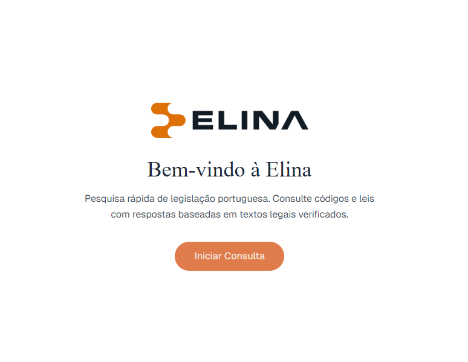
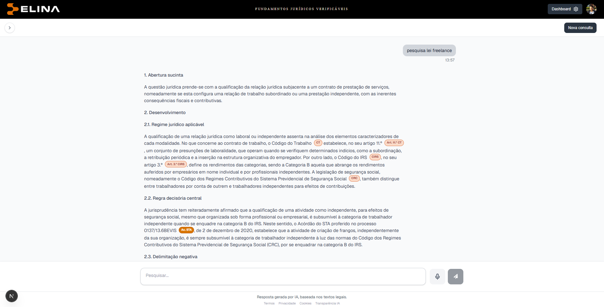
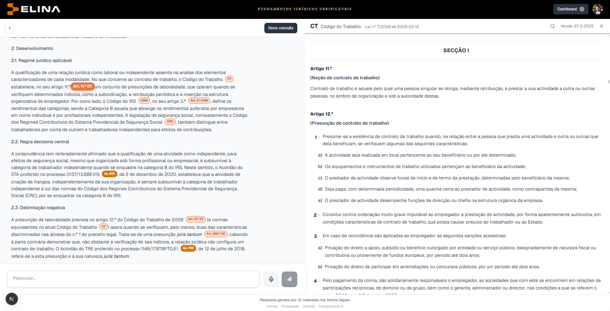
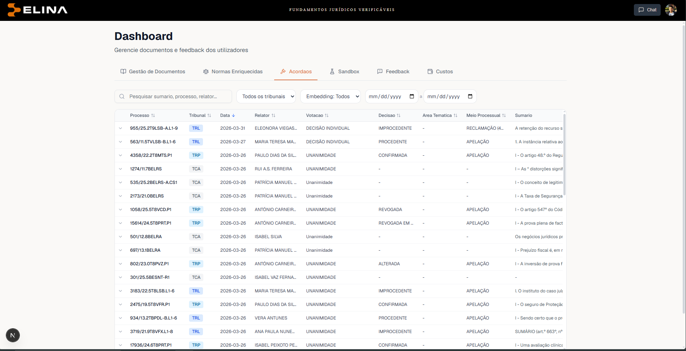
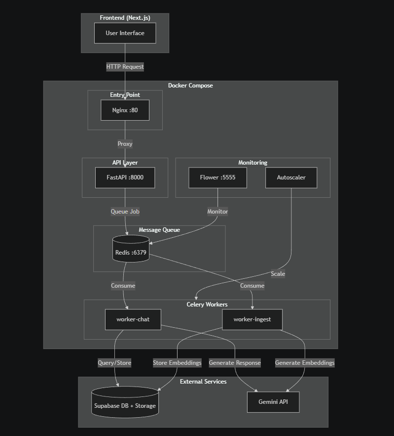
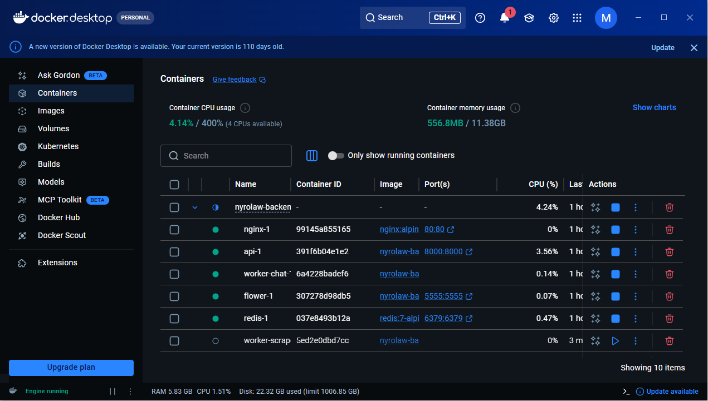

<div align="center">

# Elina

### Fundamentos jurídicos verificáveis — AI-powered Portuguese legal research

Elina answers questions about Portuguese law with grounded, **verifiable** citations.
Every answer links directly to the underlying article in the statute or to the
court decision (acórdão) it relies on — so the reasoning can always be traced
back to the source text.

</div>

<div align="center">



</div>

> **Note** — This is a public showcase of the project. The application source
> code is in a private repository; this repo exists to explain what Elina is,
> show how it works, and document its architecture.

---

## What it does

Portuguese legal research means working across dozens of codes (Código Civil,
Código do Trabalho, CIRS, …), constantly-updated legislation, and a large body
of jurisprudence. Elina lets a user ask a question in plain language and get
back a structured legal answer where **every claim is anchored to a source**:

- **Grounded answers, not hallucinations.** Responses are built from the actual
  ingested legal corpus (hybrid vector + keyword retrieval over the statutes and
  case law), then synthesized by a multi-agent LLM pipeline.
- **Inline, clickable citations.** Each cited norm appears as a chip
  (`Art. 11.º CT`, `Art. 3.º CIRS`, `Ac. STA …`). Clicking it opens the exact
  document and scrolls to the cited article.
- **Side-by-side reading.** The legal document viewer opens next to the answer,
  highlighting the relevant article so the user can read it in full context.
- **Curated corpus.** Legislation and jurisprudence are scraped, parsed,
  classified, chunked and embedded from official sources (DRE / Diário da
  República, dgsi.pt, juris.stj.pt) and managed through an admin dashboard.

---

## Screenshots

### Verifiable answers with inline citations

A natural-language query (*"pesquisa lei freelance"*) returns a structured legal
analysis. Every referenced norm is a chip linking back to the source — the
footer makes the grounding explicit: *"Resposta gerada por IA, baseada nos
textos legais."*

<div align="center">

</div>

### Click a citation → jump straight to the article

Clicking a citation opens the legal document viewer side-by-side and scrolls to
(and highlights) the exact cited article inside the diploma.

<div align="center">

</div>

### Admin dashboard — corpus & jurisprudence management

Manage ingested documents, scraped norms, and the jurisprudence index (process
number, court, date, embedding status, classification, …).

<div align="center">

</div>

---

## Architecture

A Next.js frontend talks to a containerized FastAPI backend. Heavy work
(retrieval, generation, ingestion, scraping) runs asynchronously on Celery
workers behind a Redis queue, with an autoscaler and a Flower monitoring
dashboard. Persistence and vector search live in Supabase (PostgreSQL +
pgvector); embeddings and grounded generation use the Google Gemini API.

<div align="center">

</div>

```
                        ┌──────────────────┐
   Next.js frontend ───▶│  Nginx (proxy)   │───▶ FastAPI ───▶ Supabase
        (Vercel)        └──────────────────┘       │         (Postgres + pgvector)
                                                    │
                                                    ├─▶ Redis ──▶ Celery workers
                                                    │             ├─ chat
                                                    │             ├─ ingest
                                                    │             └─ scrape
                                                    │
                                                    └─▶ Google Gemini API
                                                        (embeddings, generation,
                                                         grounded search)
```

### The running stack

The backend ships as a Docker Compose stack — Nginx, the FastAPI API, Redis,
the Celery chat / ingest / scrape workers, and the Flower dashboard:

<div align="center">

</div>

---

## Tech stack

| Layer | Technology |
|---|---|
| **Frontend** | Next.js 15 · React · TypeScript · Tailwind CSS |
| **Backend** | FastAPI · Python 3.13 |
| **Async / queue** | Celery · Redis · Flower (monitoring) · custom autoscaler |
| **Data & search** | Supabase (PostgreSQL + pgvector) · hybrid vector + keyword retrieval with RRF fusion |
| **AI** | Google Gemini (embeddings, generation, grounded search) · multi-agent pipeline |
| **Infra** | Docker Compose · Nginx · deployed on Hetzner (backend) + Vercel (frontend) |
| **Auth & storage** | Supabase Auth · Supabase Storage |

---

## How a question becomes a grounded answer

1. **Retrieve.** The query is run through hybrid retrieval (semantic vector
   search + keyword search, fused with Reciprocal Rank Fusion) over the
   embedded legal corpus.
2. **Ground.** Candidate norms and acórdãos are resolved to their canonical
   source documents.
3. **Synthesize.** A multi-agent LLM pipeline (classification → retrieval →
   curation → synthesis → drafting) composes the answer.
4. **Cite.** Each referenced norm is inserted as a clickable chip mapped to the
   exact article in the document viewer.

---

## Compliance

Built for a real legal practice, Elina handles user data under GDPR: data
minimization, retention/purge jobs, processing-restriction support
(Art. 18), and audit logging.

---

<div align="center">
<sub>© Elina — proprietary. This repository is a showcase; it does not contain the application source code.</sub>
</div>
